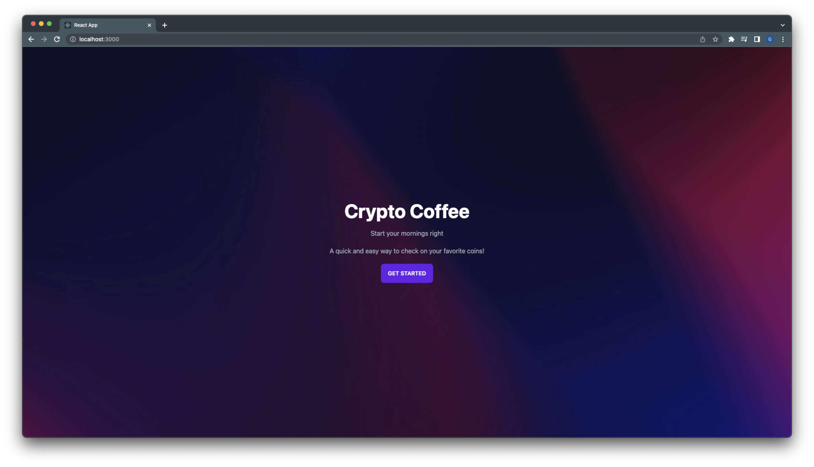
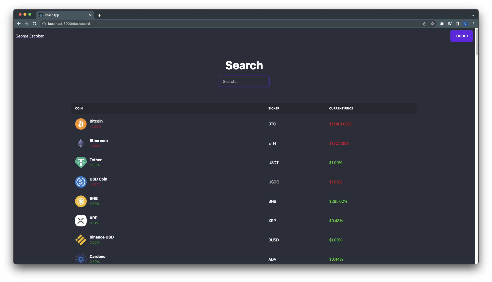

# Crypto Coffee

React application where users can get a information for their favorite cryptocurrencies. The application uses Firebase for authentication and pulls data from the Coingecko API.

---

## License


---

## Table of Contents:

- [License](#license)
- [Technologies](#technologies)
- [Installation](#installation)
- [Application](#application)
- [Contact](#contact)

---

## Technologies:

- React
- Firebase
- Tailwind

---

## Installation

- This is a Node.Js based application. If not using the Heroku link please follow the instructions to get the application running on your server.

1. Clone repo from GitHub

   ```
   gh repo clone geoescobar/crypto-coffee
   ```

2. Download dependencies at root level in the integrated terminal

   ```
   npm install
   ```

3. Launch application

   ```
   npm run start
   ```

---

## Application

#### [Demo]()




---

## Contact

#### If you have any questions about this repo or want to send a message my contact info is below!

- https://github.com/geoescobar
- geo.escobar214@gmail.com
